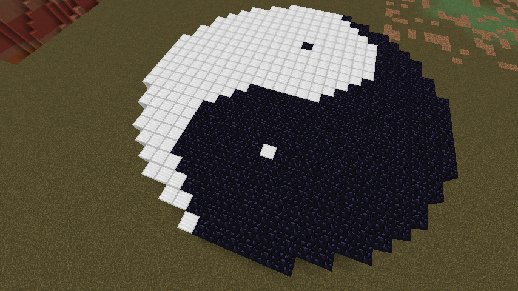
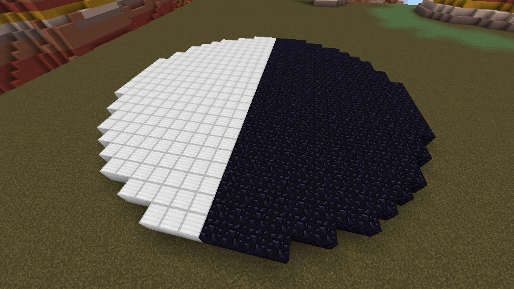
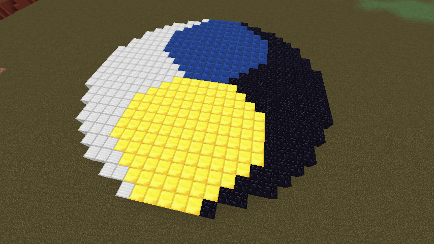

Yin och Yang
============

yinyang.js har funktionen

```javascript
function yinyang(matrial1, matrial2, radie, hojd)
```

som ritar upp yin & yang symbolen:



Filen består dessutom av några hjälpfunktioner som används för att göra det hela
lite lättare.

```javascript
function halvcirkel(matrial, radie, hojd, left)
```
halvcirkel ritar en halvcirkel, antingen till vänster (om left = true) eller till
höger (om left = false). Används till att lägga grunden för symbolen med två cirkelhalvor
sidan om varandra.



```javascript
function cirkel(matrial, radie, hojd)
```
Cirkel är väldigt lik cylinder funktionen, skillnaden är att cylinder ritas ut 
till höger om där man tittar, medan cirkel ritas ut precis mitt framför.

Den används till att rita upp två mindre cirklar innuti symbolen, här illustrerat 
med gul och blå cirkel.

